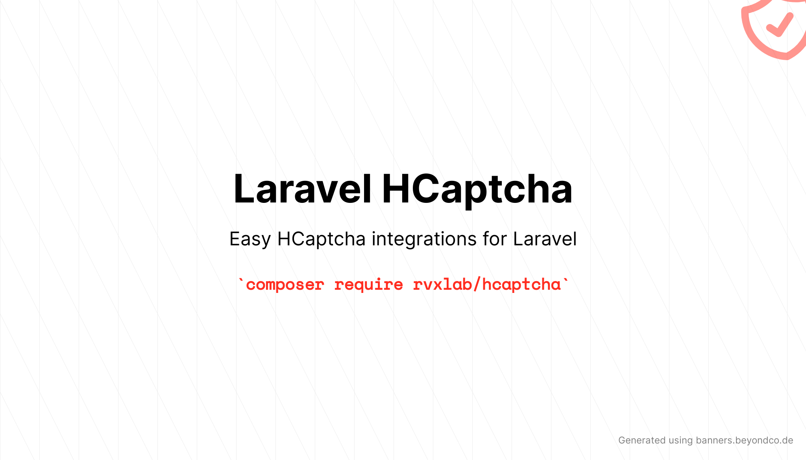

# Laravel HCaptcha

[](https://packagist.org/packages/rvxlab/hcaptcha)
[](https://github.com/RVxLab/hcaptcha/actions/workflows/run-tests.yml)
[](https://github.com/RVxLab/hcaptcha/actions/workflows/php-cs-fixer.yml)
[](https://packagist.org/packages/rvxlab/hcaptcha)

# Looking for a maintainer

I don't have the intention to maintain this package any longer. Captchas only punish the end user and are easily bypassed by bots. 

If someone wants to take over, feel free to open a discussion and tag me in it. 

---

A package to easily include [HCaptcha](https://hcaptcha.com) in Laravel.

This project is originally based on [laravel-reCAPTCHA](https://github.com/Dylanchouxd/laravel-reCAPTCHA) and forked from [Scyllaly](https://github.com/scyllaly), who seemingly abandoned the project.

This fork is a near-drop-in replacement for Scyllaly's package, maintaining the same namespace for 4.x and 5.x versions.

## Requirements

| Laravel version | Minimum PHP version |
|-----------------|---------------------|
| 8.x             | 7.4                 |
| 9.x             | 8.0                 |
| 10.x            | 8.1                 |
| 11.x            | 8.2                 |

Need support for Laravel 7 or before? Check the [4.x branch](https://github.com/RVxLab/hcaptcha/tree/4.x).

## Installation

Install the package with Composer:

```shell
composer require rvxlab/hcaptcha
```

Publish the config file:

```shell
php artisan vendor:publish --tag="hcaptcha-config"
```

Optionally publish the translations:

```shell
php artisan vendor:publish --tag="hcaptcha-lang"
```

Optionally publish the views:

```shell
php artisan vendor:publish --tag="hcaptcha-views"
```

## Configuration

Add `HCAPTCHA_SECRET` and `HCAPTCHA_SITEKEY` in **.env** file :

```
HCAPTCHA_SECRET=secret-key
HCAPTCHA_SITEKEY=site-key
```

You can obtain them from [your HCaptcha dashboard](https://dashboard.hcaptcha.com).

## Usage

### Prepare the script

First you need to initialize the script:

```html
{!! HCaptcha::renderJs() !!}
// Or
<x-hcaptcha::script />
```

You can optionally set the locale and the custom callback function:

```html
{!! HCaptcha::renderJs('nl', true, 'myCallbackFunction') !!}
// Or
<x-hcaptcha::script lang="nl" :has-callback="true" on-load-class="myCallbackFunction" />
```

You can also use the app locale if you have a multilingual application:

```html
<x-hcaptcha::script use-app-locale />
```

### Render the widget

This package provides support for the regular widget, as well as the invisible captcha.

Initialize the regular widget:

```html
{!! HCaptcha::display() !!}
// Or
<x-hcaptcha::widget />
```

Any attributes can be passed as an array to the `display` method or as properties on the Blade component:

```html
{!! HCaptcha::display([ 'class' => 'my-widget', 'data-test' => 'Test' ]) !!}
// Or
<x-hcaptcha::widget class="my-widget" data-test="Test" />
```

### Invisible widget

If you rather want forms to have an invisible widget:

```html
<form id="register-form" method="post" action="{{ route('register') }}">
    <input type="text" name="email" />
    
    <input type="password" name="password" />
    
    {!! HCaptcha::displaySubmit('register-form', 'Submit', [ 'class' => 'btn' ]) !!}
    // Or
    <x-hcaptcha::submit form-identifier="register-form" class="btn">
        Submit
    </x-hcaptcha::submit>
    @csrf
</form>
```

If you have a custom callback defined for your forms you can define a `data-callback` attribute:

```html
{!! HCaptcha::displaySubmit('register-form', 'Submit', [ 'class' => 'btn', 'data-callback' => 'userDefinedCallback ]) !!}
// Or
<x-hcaptcha::submit form-identifier="register-form" class="btn" data-callback="userDefinedCallback">
    Submit
</x-hcaptcha::submit>
```

## Validation

Add `'h-captcha-response' => 'required|HCaptcha'` to the rules array:

```php
class RegisterRequest extends \Illuminate\Foundation\Http\FormRequest
{
    public function rules(): array
    {
        return [
            'email' => 'required|email|exists:users,email',
            'password' => 'required',
            'h-captcha-response' => 'required|HCaptcha',
        ];
    }
}
```

## Testing

You can mock the HCaptcha validation by calling the `shouldReceive` method on the `HCaptcha` facade:

```php
HCaptcha::shouldReceive('verifyResponse')->once()->andReturnTrue();

HCaptcha::shouldReceive('display')->andReturn('<input type="hidden" name="h-captcha-response" value="1" />');
```

Or when testing a JSON call:

```php
HCaptcha::shouldReceive('verifyResponse')->once()->andReturnTrue();

$response = $this->json('POST', '/register', [
    'h-captcha-response' => '1',
    'email' => 'john@example.com',
    'password' => '123456',
]);
```

## Upgrading

Check the [Upgrade Guide](./UPGRADING.md) for notes on updating from 4.x to 5.x.

## License

This package is licensed under [MIT](./LICENSE).
